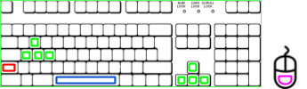
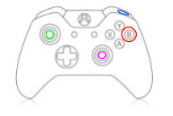
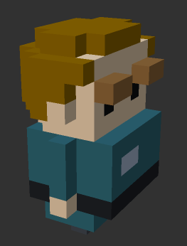
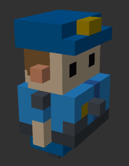
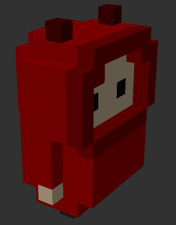
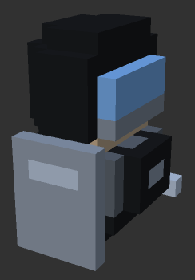
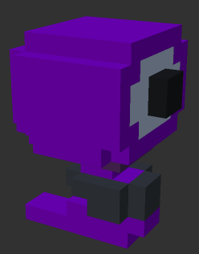
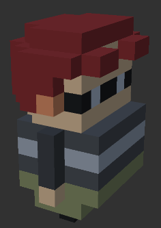

<h1 align="center">Unity3D AI and Procedural Generation Framework</h1>


### Getting Started


The build4_Data folder and the build4 executable together make up the functioning build of our game demo.  It's meant to serve as an example of what you can do using our framework.  To use this, download the build4 executable and the build4_Data folder and put them in the same directory.  Run build4.exe to play.


The src folder contains just the code that we used in this project, organized by what we wrote it for and whether we got it from an outside source.  


The Prototype folder contains a buildable Unity project folder, complete with the scenes, art assets, and the code in the src folder. Opening the Prototype folder in Unity 5.6 or later gives you access to everything that we had working on the game.  Be sure to include all three scenes in Build Settings before building your own executable.

----------

### End User Guide

_This portion of the guide is intended for laypeople who are using our system to play on the simple levels we created, or to explore our work and play around with it. Feel free to use it either to learn or just for fun! If you are a Unity Developer looking to use our framework, please jump to “Developer Guide” section._


In order to use our framework, you must have [installed Unity](https://unity3d.com/get-unity/download) on your machine first. Next, download our files and place them in a directory of your choice. Open Unity, and then hit “Open” and choose the folder where you saved the files. Unity will load and compile all the scripts and the environment.  If you only want to play the game, you can download and run the compiled executable and skip the above steps (although you won’t be able to see how the game works under the hood).


With either the executable or the Unity project available on your computer, you can test run the three scenes in the game.  The first scene, “Companion Demonstration,” serves as Level 1.  In here, every time you or the companion character collects a gold piece, you get one point.  You can engage the Companion by pressing the _Right Mouse Button_, and then clicking on him with the _Left Mouse Button_ will make him glow.  If he is glowing, he is able to be directed around the map.  _Left clicking_ again anywhere will cause the Companion to move to that destination.

“ProtectorDemoScene” is Level 2, and you get points by catching up to the red wanderer (WandererAI).  Getting caught by the large riot cop protecting it (ProtectorAI) makes you lose a point. So watch out: he can be quite fast!  

“StalkerPredatorDemo” is Level 3.  There are no points in Level 3; you must evade the policemen (PredatorAI) and the security drones (StalkerAI) until you get caught.  Any time while running the final build of the game, you can change the level or reload your current level by hitting the corresponding number key (1 for level 1, 2 for level 2, etc).  To quit, press the _Esc_ key.


All three levels have the same player movement controls.  You view the tiled map from a first person perspective, moving with the _WASD_ keys or the arrow keys and looking around with the mouse.  You can jump with the _Space_ and sprint with _Left Shift_.  Plugging in a gamepad or Xbox controller will also work.  Moving and looking around is done with the left and right analog sticks, respectively.  Holding down the _B_ button makes your character sprint, and tapping _R1_ or the right bumper makes your character jump.


<p align="center"></p>


----------

### Developer Guide


_This portion of the guide is intended for developers who aim to use our system in their project, build on it, and everything in between. We assume you have basic familiarity with Unity’s physics engine, C# scripting, and have already made a practice game or two in some Unity tutorial on the internet. If you don’t fit these criteria, you can still plow along, but we encourage you to search on the web for any Unity terms like NavMeshAgent, RigidBody, etc. that you haven’t encountered before, understand it first, then resume reading this guide. If you are new to Unity and just want to try out the simple levels we created or explore our work and play around with it, jump above to “End User Guide” section._</br></br>

+ **Part A: Main Character** 

So, you’re out to create your first game with a bunch of characters. Where do you start? Well, you first need to create your main character. Our demo main character is the one you’ll be controlling. That is, your mouse and keyboard instructions (if any) will be directing it. This is in contrast to the NPC (non-playable characters), which control themselves.  They will make up a lengthy part of this guide, but let’s talk about getting that player going first!


In Assets/Player, you will find a bunch of files, scripts, and very short audio clips for animation sounds. Most of these files come with Unity’s Standard Assets package. They include settings for camera view (for following the player), movement, speed, actions (such as jump or run). If you would like to change any of these settings (for example, change from 1st person view to 3rd person view or change buttons responsible for character’s control), then that could be done inside the Unity engine itself. If you would like to learn more about the Standard Assets package, we encourage you to take a look at Unity’s documentation of it [here](https://docs.unity3d.com/Manual/HOWTO-InstallStandardAssets.html).


The 3 small scripts in the folder were created by us and simply keep track of basic functions such as the player’s score, level selection, and the whether or not the player has been caught by one of our NPCs. Any new  scripts that deal with the player should be put in this folder as well.  They can be attached to the player as components, and can add a plethora of functions to what the player is able to do.

Also note - this is a small programming detail - some variables associated with the player scripts are set to be static.  Take the score variable in the PlayerScore script for instance; it is set to static to be easily accessible from outside the script (we can access it by simply saying _PlayerScore.score_, rather than having to get the script component and access it by that script instance).  Why would we want that?  

Well, many other items, enemies, and objects can potentially influence our score (gold for instance should increment the score when we collect a piece).  That means that we want our gold pieces to be able to quickly get at this score variable, so that is one advantage.  We also know we only want one score to be kept for the player, and having that variable static forces that to be the case.  

This is just a small detail, but it can be very useful for many variables associated with the player, as they often need to be easily accessible and only kept once.  Further examples include things like health, level, experience gained, current quest, current ammo, and more depending on the kind of game you’re making.  We point this out simply because it might be confusing why we set some of these variables to be static and not others, and also because it may be a useful trick for you to use as well.</br></br>

+ **Part B: NPC AI (Non-playable character artificial intelligence)**</br></br>Now comes the fun part: scripting the NPCs! This section might come across as overly detailed at times, but we only do so to take into account all programming and Unity expertise levels possible in our audience. We will first start with the main components, the so called, “Parent class” of our NPCs, and its two helper classes. If you are not familiar with a parent class, fear not: a parent class in programming is simply a common set of functions or features code-wise that will be shared among all child objects. For instance, each NPC will be a child of its parent class “CoreAI”. CoreAI has functions that will be shared among all NPCs like returning the position of the NPC, or moving towards the player, etc. Having this modular design prevents us from redundantly copying code into each NPC (check out the above link for more details on the concept of modularity).

    + **CoreAI Library:** This library contains all basic functions that every NPC character will possess, and will have access to. If you are constructing your own character, you can construct a new character in Unity and attach to it the following script and edit it, where the Update() function and other functions you would write would be specific to the NPC character you have in mind. Having your NPC AI a child of the CoreAI module gives it access to all the instance variable and useful functions available in CoreAI. As good practice, always have the CoreAI.cs file open in another tab in your code editor because you would definitely find its functions useful!</br></br>

    ``` cs
    using System.Collections;
    using System.Collections.Generic;
    using UnityEngine;
    using UnityEngine.AI;

    public class Your_NPC_AI : CoreAI
    {
        protected void Start()
        {
            CoreAIStart(); 
        }

        // Update is called once per frame
        void Update()
        {
            // insert your own code here
        }
    }
    ```
    
    Our comments for the CoreAI module are pretty thorough, so we will direct you to the CoreAI file should you want to see what it offers. For examples, our NPC AIs we created (CompanionAI, GuardAI, PredatorAI, ProtectorAI, SlendermanAI, StalkerAI, WandererAI) all have some degree of usage of the CoreAI functions and instance variables so you can see them in action.
    
    You will notice that there’s a Vision.cs and a Movement.cs file in the AI Library folder as well. These files are the two helper classes mentioned above, and they handle some of the implementations for the functions in CoreAI.cs. If you want to see how some of these functions work, feel free to open those files and take a look. If you just want to use the functions in your NPC AI implementation and don’t care how they work, the CoreAI file will handle all your needs.
    
    We would like to note one thing however: movement is implemented with Unity’s built-in NavMesh system, and if you want to use our movement functions, you will need to give your NPCs a NavMeshAgent component.  The NPCs that we provide will have this, and anything you build off of them should be fine, but if you make something from scratch and want to use our movement functions, _make sure to include that NavMeshAgent!_
    
    + **NPC_AI Library:** The NPC library is composed of sample scripts for some common NPCs. Our goal when producing these NPCs was twofold: first, provide ready-to-use NPC AI scripts for the most common NPCs, with the intention of alleviating the amount of work novice Unity developers need to do when starting to build their game. Second, and most importantly, have examples for how the CoreAI module can be used when making your own NPCs. Below is a summary of our NPCs and their behavior(s).
    
        +  **CompanionAI:** This script will make its character act as a companion to the main player. By default, the companion is inactive. However, once the player right-clicks, the companion wakes up and will start following the player around. The player can also left-click on the companion character to make the companion stop in place and await directions. Left-clicking on any object or location afterwards will direct the companion to walk to that object or location. Left-clicking on the companion character while he is waiting for directions will tell him to stop listening and begin following the player again. If the player wants to deactivate the companion, they can just right-click again.</br></br>
        
        +  **PredatorAI:** This script will make its character be a predator to the player. The predator will not move unless the player comes in its field of vision, at which point the predator will charge (sprint) at the player. If the predator loses the player, it will move towards the last seen position and start looking from there by rotation to see if the player is near. If it finds the player, it charges again. If it doesn’t, it returns to its neutral state at the beginning.</br></br>
        
        +  **WandererAI:** This script will make its character wander around aimlessly, changing direction every 20ish units of in-game space. This is reminiscent of pedestrians found in a lot of open-world games.  The Wanderer can also be ‘attacked’ or ‘collected’ by the player, and doing so triggers it to be in danger.  If the Protector sees that the Wanderer is in danger, it will react accordingly.</br></br>
        
        +  **ProtectorAI:** This script will make its character a sort of “body-guard” to the Wanderer. As a result, it follows the Wanderer around and tries to stop the player from reaching it.  If the player gets too close, the Protector will move to place itself between the player and the Wanderer, and will face the player.  It may also grunt and make noises occasionally, which are signals to the player that they’re too close!  If the player physically touches the Wanderer to try to get points, the Protector will realize that you are a threat, and it will charge the player!  Music will start as well to signal that the player is in danger from the angry Protector.  After some time, the Protector will calm down, and if the player gets far enough away from it, the Protector will forget about you and go back to the Wanderer.</br></br>
        
        +  **StalkerAI:** This script will make its character stalk the player. Stalking is defined on these two conditions: the player can never see the stalker move towards it and the stalker must never get too close to the player (defined by some arbitrary unit distance away from the player). Therefore, only when the player does not have the stalker in its field of vision and when the player is not too close will the stalker actually move towards the player.</br></br>
        
        +  **SlendermanAI:** This script is weird because the Slenderman NPC is quite literally never seen by the player. In fact, the character doesn’t actually make an appearance in any demo scenes (at least, as far as we know…).  However, for a developer, it can come in handy for implementing some Slenderman-like game. The script when attached to any character makes it ALWAYS outside the field of view of the player and within a certain distance away from it. This means that as the player looks around, the Slenderman is always going to be behind it and move accordingly… and just might be programmed to appear when the player least expects it.</br></br>
        
+ **Part C: Real-time Procedural Generation**
        
[Procedural generation](https://en.wikipedia.org/wiki/Procedural_generation) is awesome. Why? Well, you’re creating visuals, an environment, and basically any data algorithmically at run time rather than pre-made. This saves on heavy designer costs, produces a less expectable game area, and offers customization and novelty on every run of the game. So yeah, it’s pretty awesome.

We would like to start with a quick disclaimer though: procedural generation can’t do everything.  If you need a well-balanced map for online multiplayer in the next hit shooter, odds are you will need human hands guiding the placement of objects in the scene.  Players will be able to tell how much thought went into the level, and when an element of randomness is introduced, it can sometimes result in levels losing their flow.  Of course, the genre of game, number of players, and many other factors go into deciding whether procedural generation is the right choice or not.  Assuming you know it will work for your game, or you’re just curious, let’s dive on in!

In order to use our procedural generation library, you will first have to decide on the Unity prefabs you would want to include. If you want a city-like structure, the prefabs could include concrete, sidewalks, buildings or walls, etc. among other things. Same goes for any environment you want to create, where you at least need a prefab of that object, say a sidewalk prefab, that our procedural generation library can use to replicate hundreds or thousands of in the way you specify.

To apply the Random Map Maker to an empty scene, place the C# script on an empty object as a component.  It will show up in that object’s Inspector View, with every field labeled.  In the Player, Reticle, NPCs column, Floor column, Ground Items column, In Air column, and Walls fields, select the Unity prefab you want to be instanced into the map.  For Npcs, Floor, Ground Items, and In Air columns, you can additionally specify the number of different items to use.  The numerical fields below these describe other features of the map, including the concentration of items compared to the number of floor tiles, variation in item sizes, and overall size of the map.

Note that the Random Map Maker by itself is standalone, without any dependencies on the CoreAI class that our characters use.  To make your procedurally generated scenes work with characters, attach Nav Mesh Source Tag components to every floor and wall prefab that the Random Map Maker uses, and a Local Nav Mesh Builder component to any one object in your scene.  We recommend placing it on the same empty object that you placed your Random Map Maker on for neatness.

From there, run the scene and see what happens!  If you notice there are too many items being strewn around your scene, try decreasing the density of the items in the DensityOfItems field in the Inspector View of your procedural generation object.  If items in air are being placed too high or too low, adjust your Y Offset variable in that same view.  If the NavMesh generation isn’t working correctly, double check that you put Nav Mesh Source Tags on each of the prefabs you gave to the script to place.  Once you have a good idea of how changing certain variables changes the map generation, try moving on to the WalledMapMaker script.

This procedural generation script differs slightly from the RandomMapMaker script in that it imposes a few more rules on how the map should be laid out.  Rather than placing items randomly (like the trees that were randomly placed for Level 2), the WalledMapMaker tries to do what its name implies: place walls in ways that make sense.  

For Level 3, this meant having rectangular arrangements of walls with varying heights, spacing between the rectangles, and also some missing walls.  We wanted to demonstrate the vision of the Predator and Stalker, so we wanted the environment to provide plenty of opportunities for them to see the player, but also for the player to evade them.  

For a more realistic and less decrepit looking city, walls could be given uniform height, with no probability of being removed.  Spacing and sizing could be made more uniform by adjusting the variables in the Inspector View.  And if that still doesn’t yield a level that you want for your game, you can try your hand at creating your own procedural generation script!

Our advice to you as you try to make your own script is simplify the problem.  Thinking in 3D can make it very hard to program your procedural generation, so it’s often easier to think in terms of 2D slices of the map, with each slice increasing in height.  Think of 3D printing: objects are created by printing slices and then stacking slices on top of those until it’s done.  Your level can be constructed in a similar way, by using a 2D array to layout your ground tiles, another 2D array to layout items attached to the ground, another 2D array to place items in the air, and so on.  If you look at our RandomMapMaker script, you’ll see that that’s exactly what we did!

On top of thinking about how you want to program your level, you need to think about how you want it to actually look, and what the rules are that govern it.  These rules will typically be patterns and probability distributions.  For example, RandomMapMaker is built around a uniform probability distribution, and this distribution is what governs where items go.  The DensityOfItems parameter is what controls the probability of placing an item.  WalledMapMaker still makes use of the uniform probability distribution to some extent, but it also adds in the pattern of the rectangular wall layout.  Finding a way to program that pattern into the map over and over made the script very short and sweet, and easy to think about.

Long story short, if you can keep the problem simple and programmable, and govern your levels with patterns and probabilities, you can produce your own procedural generation scripts.  You may feel limited now in what you can produce, but if you think about how to model the level that you want to create, odds are you can come up with something that will work.  Take a look at our two scripts to get a sense of what to do, and then start working!</br></br>


----------

**Final Thoughts**

Whether you’re looking to develop the next big hit, learn a bit more about game development and programming, or just have fun messing around with a cool tool, we hope you’ll be able to get some use out of our little project.

We have plans to continue development down the road, adding to the CoreAI library, refining our procedural generation scripts, and adding additional AI NPCs.  Hopefully, our project should become big enough to be posted on the Unity store.

Our hope is that many people will be able to use our tool to learn about game development, and produce the games that they otherwise didn’t think they would be able to make.  There are so many artists and storytellers out there that have ideas to share with the world, and we want them to be able to use what we built to make their work come to life.

Thanks for reading, and happy devving!
